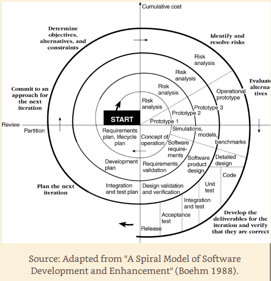

# Spiral Model

## Overview

- risk-oriented
- breaks projects into miniprojects
- each miniproject addresses one or more major risk
- iterates (repeats) until having addressed all major risks
- terminates as a water lifecycle model would

## Defines risk broadly

- poorly understood requirements
- poorly understood architecture
- potential performance problems
- potential problems in underlying tech
- etc

## Cinnamon Roll starts Small in Middle

- explore the risks
- make a plan to handle the risks
- commit to an approach for the next iteration
- each iteration scales up the project
- roll up one layer, check it against requirements, move to the next layer.

# Iterations / Layers

1. Determine objectives, alternatives, contraints
2. Identify and resolve risks.
3. Evaluate alternatives.
4. Develop deliverables for that interation; verify correctness.
5. Plan the next iteration.
6. Commit to an approach for the next iteration. 

# As Costs Increase Risk Decreases

> One of the most important advantages of the spiral model is that as 
> costs increase risk decreases. The more time and money you spend, the
> less risk your taking, which is exactly what you want on a rapid-development
> project.

# Flexibility

- you can have as many loops as necessary
- you can bounce around the six steps (though that order often helps)
- you can tailor each iteration to suit the project
- you can combine it with other lifecycle models

# Combinations

- begin with a series of risk-reduction iterations
- conclude with a waterfall or evolutionary delivery model
- incorporate other lifecycle models as interations
- e.g., throwaway prototying as a performance interation

# Management Control

- provides high levels
- at least as much as the traditional waterfall model
- you have checkpoints at the end of each iteration
- you have early indications of insurmountable risks
- you find out early at the least possible cost

# Disadvantage

- complicated
- requires conscientious, attentive, and knowledge management
- difficult to define objective, verifiable milestones
- avoid this model with low-risk product development

# Main Advantages
- progress visibility
- reduced risk